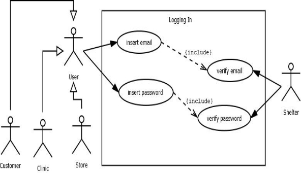
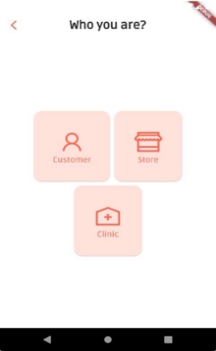
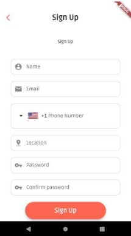
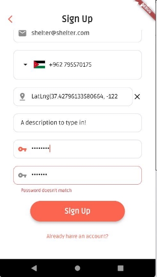

**Abstract**

Shelter application aims to provide care for the animals and to make it easy for the customer to adopt or buy a pet or animal care from the health side, display pet needs, the main goal for our application is to provide a new home for the pets and provide care for them. Shelter helps the customer to adopt the animal according to the animal profile.

The customer can connect the clinics for counseling, buying, and adopting.

**Table of Contents**

[**Chapter 1: Introduction**](#_page1_x18.00_y526.50)

1. [Overview](#_page2_x18.00_y85.50)
1. [Project Motivation](#_page2_x18.00_y167.25)
1. Project Objectives
1. Review of Related Literature and Systems

[**Chapter 2: The Development Process**](#_page5_x18.00_y67.00)

2.1     MVP

[**Chapter 3: Requirements Engineering and Analysis**](#_page5_x18.00_y616.75)

1. [Stakeholders](#_page5_x18.00_y653.50)
1. [Functional Requirements](#_page6_x18.00_y516.25)
1. [Non-Functional Requirements](#_page6_x18.00_y551.50)
1. Use Case Diagram
1. [Use Case Descriptions](#_page17_x18.00_y419.50)

[**Chapter 4: System Design**](#_page21_x18.00_y677.50)

1. [Sequence Diagrams](#_page22_x18.00_y92.50)
1. Class Diagram
1. ER Diagram

[**Chapter 5: System Implementation**](#_page30_x18.00_y407.50)

1. [Overview](#_page30_x18.00_y430.75)
1. [Tools and Technologies Used](#_page30_x18.00_y550.00)
1. system specification**.**

**Chapter 6: Testing and Validation [Chapter 7: Conclusion and Future Work** ](#_page46_x18.00_y627.25)[References**](#_page46_x18.00_y722.50)**

**Chapter 1: Introduction**

1. **Overview**

We are all aware of the importance of applications that revolutionize the world of technology, so we were directed to work on it that fit the current situation. We worked on the Shelter application to give the bright light for taking care of the animals.

2. **Project Motivation.**

`  `**What are the reasons behind your choice to develop this project?**

The idea came to solve a problem in the Arab world that the animal sector does not give attention to. and the application revolves around more than one idea which is providing the user many services such as adopting, buying pets, and pet's need to save time and effort.

3. **Why is your project important?**

Animals are living creatures that feel everything around them, they rejoice, grieve, and suffer, but the thing that makes them different from us is that they cannot express what they feel, and it's from the human side, take care of them, so this application came as a modern way to keep pace with the times for animal care.

4. **Review of Related Literature and Systems**

Here’s a review of related applications see figures below:

1. **Lukyamman Application**

This is a Store Application specialized only in the sale of pets and it's just one store.

Our application is distinguished from the Lukyamman application, it provides many services such as offering a lot of stores everywhere and any time to buy what the animal needs and selling or adopting animals also display clinics that enable the user to communicate with it to treat his pet and receive vaccinations [2].

 

**Figure 1.1** Lukyamman Application

2. **11pets: Pet care Application.**

The 11pets app is too complicated for the user!

Our application is distinguished from the 11pets application in that it provides many screens that express each available service, it is easy to use (user friendly) for every user, also it provides in the introduction screen explains in detail how the application works, so that the user can know exactly what he wants [3].

  

**Figure 1.2** 11pets: Pet Care Application

**Chapter 2: The Development Process**

The MVP architecture pattern is a derivation from the MVC pattern where the Controller is replaced by the Presenter. The MVP divides an application into three layers: Model, View, and Presenter. See the figure below that shows the process in MVP.

**Figure 2.1** Model View Presenter(Provider)

- **MVP stands for Model View Presenter(Provider).**

MVP is a user interface architectural pattern engineered to facilitate automated unit testing and improve the separation of concerns in presentation logic:

1. The model is an interface defining the data to be displayed or otherwise acted upon in the user interface.
1. The view is a passive interface that displays data (the model) and routes user commands (events) to the presenter to act upon that data.
1. The presenter acts upon the model and the view. It retrieves data from repositories (the model), and formats it for display in the view.
- **Good Flutter with MVP**

When you build an MVP app in Flutter you build two applications — iOS and Android — nearly simultaneously. Flutter and other cross-platform tools allow you to create one codebase that can be used on iOS and Android, which saves you up to 70% of the development time. ... Flutter is the one toolkit that helps win this battle.

**Chapter 3: Requirements Engineering and Analysis**

1. **Stakeholders**
1. Customer (User)
1. Store Owner (User).
1. Clinic (User).
1. Admin (User).
2. **Functional Requirements**
1. Signing Up as a customer user
2. Signing Up as a store user
2. Signing Up as a clinic user
2. Logging In as a customer user
2. Logging In as a store user
2. Logging In as clinic user
2. Viewing.
2. Adding, Editing, Deleting For Customer
2. Adding, Editing, Deleting For Store
2. Adding, Editing, Deleting For Clinic
3. **Non-Functional Requirements**
1. Availability.
1. Portability.
1. Security.
1. Performance Requirement
1. Usability.
1. Installability
4. **Use Case Diagrams**
1. User Registration.
1. User View Screens.
1. User ways to add, edit and delete.
5. **Use Case Description**
1. Table 1: Users Registration
1. Table 2: Login
1. Table 3: Reset Password
1. Table 4: Viewing
1. Table 5: Items
1. Table 6: Pets
1. Table 7: User Profile
2. **Functional Requirements**
1. **Signing Up as a customer user:**
1. The Shelter Application shall provide the customer user with the ability to insert his/her name.
1. The Shelter Application shall provide the customer  user with the ability to insert his/her email.
1. The Shelter Application shall check the email to be formatted.
1. The Shelter Application shall provide the customer user with the ability to insert the password.
1. The Shelter Application shall check the customer user password to be at least 8 characters.
1. The Shelter Application shall check the customer user password to be confirmed.
1. The Shelter Application shall provide the customer user with the ability to submit the form.
1. The Shelter Application shall take the customer user to his section login screen.
2. **Signing Up as a store user**
1. The Shelter Application shall provide the store user with the ability to insert the store name.
1. The Shelter Application shall provide the store user with the ability to insert the store email.
1. The Shelter Application shall provide the store user with the ability to insert the store password.
4. The Shelter Application shall check the email to be formatted.
4. The Shelter Application shall provide the store user with the ability to insert a store phone number.
4. The Shelter Application shall provide the store user with the ability to insert the store phone number country code.
4. The Shelter Application shall provide the store user with the ability to insert the store location.
4. The Shelter Application shall check the user password to be at least 8 characters.
4. The Shelter Application shall check the user password to be confirmed.
4. The Shelter Application shall provide the store user with the ability to submit the form.
4. The Shelter Application shall take the store user to his section login screen.
3. **Signing Up as a clinic user:**
1. The Shelter Application shall provide the clinic user with the ability to insert the clinic name.
1. The Shelter Application shall provide the clinic user with the ability to insert the clinic email.
1. The Shelter Application shall check the email to be formatted.
1. The Shelter Application shall provide the clinic user with the ability to insert a phone number of the clinic.
1. The Shelter Application shall provide the clinic user the ability to insert the phone number country code for the clinic.
1. The Shelter Application shall provide the clinic user with the ability to insert the clinic location.
1. The Shelter Application shall check the user password to be at least 8 characters.
1. The Shelter Application shall check the user password to be confirmed.
1. The Shelter Application shall provide the clinic user with the ability to submit the form.
1. The Shelter Application shall take the clinic user to his section login screen.
4. **Logging in as a customer user:**
1. The Shelter Application shall check the owner account email.
1. The Shelter Application shall check the owner account Password to be matched.
1. The Shelter Application shall take the user to the home screen.
5. **Logging in as a store user:**
1. The Shelter Application shall check the store owner account email.
1. The Shelter Application shall check the store owner account password to be matched.
1. The Shelter Application shall take the user to the home screen.
6. **Logging in as a clinic user:**
1. The Shelter Application shall check the clinic owner account email.
1. The Shelter Application shall check the clinic owner account password to be matched.
1. The Shelter Application shall take the user to the home screen.
7. **Viewing:**
1. The Shelter Application shall provide the user with the ability to display the **Home Screen**.
1. The Shelter Application shall provide the user with the ability to make a new post.
   1. The Shelter Application shall provide the user with the ability to upload an image from the gallery.
   1. The Shelter Application shall provide the user with the ability to type a text.
1. The Shelter Application shall provide the user with the ability to like a post.
2. The Shelter Application shall provide the user the ability to display the **Store Screen**.
1. The Shelter Application shall provide the user the ability to display a list of

items.

1. The Shelter Application shall provide the user with ability to display the price of the item.
1. The Shelter Application shall provide the user with the ability to make a

like button to an item.

2. The Shelter Application shall provide the user the ability to display a list of pets.
1. The Shelter Application shall provide the user the ability to display pet descriptions.
1. The Shelter Application shall provide the user the ability to display the image of the pet.
1. The Shelter Application shall provide the user the ability to display the pet's name.
1. The Shelter Application shall provide the user the ability to display the pet's type.
1. The Shelter Application shall provide the user the ability to display the pet's age.
1. The Shelter Application shall provide the user the ability to display the pet's gender.
1. The Shelter Application shall provide the user the ability to display the price of the pet.
1. The Shelter Application shall provide the user with the ability to make a

like button to a pet.

3. The Shelter Application shall provide the user the ability to display the store

phone number.

2.3.1. The Shelter Application shall provide the user the ability to call the store.

3. The Shelter Application shall provide the user with the ability to display the **Profile Screen For The Customer.**
1. The Shelter Application shall provide the user the ability to display the name.
1. The Shelter Application shall provide the user the ability to display the profile photo.
1. The Shelter Application shall provide the user the ability to display the email.
1. The User shall be able to log out from the application by clicking on the logout

button.

4. The Shelter Application shall provide the user with the ability to display the **Profile Screen For The Clinic.**
1. The Shelter Application shall provide the user the ability to display the name of the Clinic.
1. The Shelter Application shall provide the user the ability to display the image of the Clinic.
1. The Shelter Application shall provide the user the ability to display the email of the Clinic.
1. The Shelter Application shall provide the user the ability to display the location of the Clinic.
1. The Shelter Application shall provide the user the ability to display the phone number of the Clinic.
1. The User shall be able to log out from the application by clicking on the logout button.
5. The Shelter Application shall provide the user with the ability to display the **Profile Screen For The Store.**
1. The Shelter Application shall provide the user the ability to display the name of the Store.
1. The Shelter Application shall provide the user the ability to display the image of the Store.
1. The Shelter Application shall provide the user the ability to display the email of the Store.
1. The Shelter Application shall provide the user the ability to display the location of the Store.
1. The Shelter Application shall provide the user the ability to display the phone number of the Store.
1. The Shelter Application shall provide the user the ability to display a list of items.
1. The Shelter Application shall provide the user the ability to display a list of pets.
1. The User shall be able to log out from the application by clicking on the logout

button.

8. **Adding, Editing, Deleting For Customer:**
1. The Shelter Application shall provide the user the ability to add a post to the **Home Screen**.
1. The Shelter Application shall provide the user the ability to add text to a post.
1. The Shelter Application shall provide the user the ability to add an image for the post.
2. The Shelter Application should provide the user the ability to edit a post.
   1. The Shelter Application should provide the user the ability to edit the text of the post.
   1. The Shelter Application should provide the user the ability to edit the image of the profile.
2. The Shelter Application should provide the user the ability to delete a post.
2. The Shelter Application shall provide the user the ability to add a photo for the profile.
2. The Shelter Application should provide the user the ability to edit the photo of the profile.
9. **Adding, Editing, Deleting For Store:**
1. The Shelter Application should provide the store user with the ability to add a new pet to a pet list by entering (image of the pet, name, age, type, price, gender).

   2. The Shelter Application should provide the store user with the ability to add a new store item to the list of items by entering (image of the item, description, price).
   2. The Shelter Application should provide the store user with the ability to edit the pet information.
4. The Shelter Application should provide the store user with the ability to edit the item information.
4. The Shelter Application should provide the store user with the ability to delete a pet from the list.
4. The Shelter Application should provide the store user with the ability to delete an item from the list.
4. The Shelter Application should provide the store user with the ability to add an image for the profile.
4. The Shelter Application should provide the store user with the ability to edit the image of the profile.
4. The Shelter Application shall provide the user the ability to add a post to the **Home Screen**.
   1. The Shelter Application shall provide the user the ability to add text to a post.
   1. The Shelter Application shall provide the user the ability to add an image for the post.
4. The Shelter Application should provide the user the ability to edit a post.
   1. The Shelter Application should provide the user the ability to edit the text of the post.
   1. The Shelter Application should provide the user the ability to edit the image of the profile.
4. The Shelter Application should provide the user the ability to delete a post.
10. **Adding Editing Deleting For Clinic:**
1. The Shelter Application shall provide the user the ability to add a post to the **Home Screen**.
   1. The Shelter Application shall provide the user the ability to add text to a post.
   1. The Shelter Application shall provide the user the ability to add an image for the post.
1. The Shelter Application should provide the user the ability to edit a post.
   1. The Shelter Application should provide the user the ability to edit the text of the post.
   1. The Shelter Application should provide the user the ability to edit the image of the profile.
1. The Shelter Application should provide the user the ability to delete a post.
1. The Shelter Application shall provide the user the ability to add a photo for the profile.
1. The Shelter Application should provide the user the ability to edit the photo of the profile.
1. The Shelter Application shall provide the user the ability to add a description for the clinic.
1. The Shelter Application shall provide the user the ability to edit the description for the clinic.
1. The Shelter Application shall provide the user the ability to add a location for the clinic.
1. The Shelter Application shall provide the user the ability to edit the location of the clinic.
1. The Shelter Application shall provide the user the ability to add a phone number for the clinic.
1. The Shelter Application shall provide the user the ability to edit the phone number of the clinic.
3. **Non-Functional Requirements**
1. **Availability**

The Shelter Application shall be at least 98 percent available on weekdays between 5:00 A.M. to 3:00 A.M. Eastern Time on the next day.

2. **Portability**

The Shelter Application shall be able to run on iOS and Android devices.

3. **Security**

Every account should be secured by email and password.

4. **Performance Requirement**

The application shall be available from all over the world at most times.

Any page of the Shelter Application should not take more than 2-3 seconds to load.

5. **Maintainability**

In case of failure that leads the system to an outage, the meantime to repair should not be more than 2 hours and push to market.

6. **Usability**

The Shelter Application should be easy to learn and operate; the user should not require more than 25min of training to operate the system.

The Customer should be able to call the store and the clinic with one click from the details screen. A trained user shall be able to find a pet and call the owner in an average of three minutes.

7. **Installability**

The Shelter Application should be easy to install from the app store(ios), google play (Android).

4. **Use Case Diagram**

In the Unified Modeling Language (UML), a use case diagram can summarize the details of our application users (also known as actors) and their interactions with the system.

Scenarios in which our application interacts with people, organizations, or external systems Goals that our application helps those entities (known as actors) achieve

The scope of our application [1].

Our Use case Have Four Actors

-Customer (User)

-Store (User)

-Clinic (User)

-Shelter(Admin)

-Each of These Actors Have a Use case

**You can see these pictures below that display use Case Diagram**

||
| - |
|**Figure 2.2** User Registration use case diagram|

||
| - |
|**Figure 2.3** User Login use case diagram|

||
| - |
|**Figure 2.4** Reset Password use case diagram|
**Figure 2.5** Viewing use case diagram

**Figure 2.6** Adding, Editing, Deleting by a Customer

**Figure 2.7** Adding, Editing, Deleting by a Store

||
| - |
|**Figure 2.8** Adding, Editing, Deleting by a Clinic|
5. **Use Case Descriptions**
- A use case is **a written description of how users will perform tasks on your website or application**. It outlines, from a user's point of view, a system's behavior as it responds to a request. Each use case is represented as a sequence of simple steps, beginning with a user's goal and ending when that goal is fulfilled [1].
- See tables below:

**Table 1:** Users Registration Use Case Description

|**ID:**|**UC-1**|
| - | - |
|**Title:**|Users Registration|
|**Primary Actor:**|Customer, Store, Clinic.|
|**Description:**|
It allows the customer to register in the Shelter Application by entering his/her information (user name, email, password, confirm password, phone number, email).

It allows the store and clinic users to register in the Shelter Application by entering (store or clinic name, email, password, confirm password, location, phone number)
|
|**Related use case:**|User Registration.|
|**Main Success Scenario. (Flow of event):**|
1. The user should register to the shelter application

2. The user should click on the sign-up button.
|

||
3. The user should select the type of account whether it’s a customer, clinic, or store.

4. The user should enter valid information.

5. The user should click on the sign-up button.
|
| :- | :- |
|**The flow of activities:**|
**User action:**

1. Enter the following information: User name, email, password, confirm password, location, phone number).

2. Click on sign up.
|
**System action:**

- Validate user name, email and confirm password if It matches the entered password.

- If the information is valid the login page will be displayed.
|
|**Precondition:**|Open the shelter application|
|**Postcondition:**|Confirm registration|
|**Extensions:**|
4a. The user enters an invalid email the system will display a

message (“Please enter your valid email”).

4b. User entered the invalid password the system will display a message (“Please enter valid password minimum of 8 char.”).

4c. Confirm password matches the password, if not a message will be displayed (“password doesn’t match”).

5a. messages will be displayed if the user keeps the fields empty.
|
**Table 2:** Login Use Case Description

|**ID:**|**UC-2**|
| - | - |
|**Title:**|Login|
|**Primary Actor:**|Customer, Store, Clinic.|
|**Description:**|It allows for users to access the Shelter Application by entering the correct email and password|
|**Related use case:**|User Login.|
|**Main Success Scenario. (Flow of event):**|
1. The User should be registered before signing in.

2. Enter the correct email.

3. Enter the correct password.
|
|**The flow of activities:**|
**User action:**

1. Enter email

2. Enter password
|
**System action:**

- Validate email and password

- Check the user.

- If the user is confirmed, display the home screen.
|
|**Precondition:**|Users should be registered to the application|
|**Post-condition:**|Confirm login|
|**Extensions:**|
2a. The user enters an invalid email the system will display a message (“Please enter your valid email”).

3a. The user enters an invalid password the system will display a message (“Please enter valid password minimum of 8 char.”).
|
**Table 3:** Reset Password Use Case Description

|**ID:**|**UC-3**|
| - | - |
|**Title:**|Reset Password.|
|**Primary Actor:**|Customer, Clinic, Store.|
|**Description:**|It allows for Users to reset passwords if they forget them.|
|**Related use case:**|Reset Password.|
|**Main Success Scenario. (Flow of event):**|
1. The user should enter the login screen.

2. The user should click on the forgot password.

3. The user should type his email.

4. The system will send a link message to the email.
|
|**The flow of activities:**|
**User action:**

1. Enter the email address.

2. click on reset.
|
**System action:**

● Send an email to the user to verify that it is him and then reset the password.
|
|**Precondition:**|Enter your email and password.|
|**Post-condition:**|The system should send a link message to reset the password.|
|**Extensions:**|
2a. if the user entered an invalid password the system will display a message (“Please enter valid password minimum of 8 char.”).

3a. if the user entered an invalid email the system will display a message (“Please enter your valid email”).
|
**Table 4:** Viewing Use Case Description

|**ID:**|**UC-4**|
| - | - |
|**Title:**|Viewing|
|**Primary Actor:**|Customer, Store, Clinic.|
|**Description:**|It allows the Users to switch between tabs in the application.|
|**Related use case:**|Viewing.|
|**Main Success Scenario. (Flow of event):**|
1. The user should be registered to the application.

2. The user should log in by entering a valid email.

3. The user should log in by entering a valid password.

4. The user will be able to switch between screens.
|
|**The flow of activities:**|
**User action:**

1. Display the home screen.

2. Display the store screen.

3. Display the clinic screen.

4. Display the profile screen.
|
**System action:**

- Open Home Screen.

- Open Item or Pet screen from the store Screen.

- Open Clinic Screen.

- Open The profile screen.
|
|**Precondition:**|Sign-in|
|**Post-condition:**|switch between tabs|
|**Extensions:**|2a. if the user entered an invalid email the system will display a message (“Please enter your valid email”).|

||3a. if the user entered an invalid password the system will display a message (“Please enter valid password minimum of 8 char.”).|
| :- | :- |
**Table 5:** Item Use Case Description

|**ID:**|**UC-5**|
| - | - |
|**Title:**|Item|
|**Primary Actor:**|Store.|
|**Description:**|It allows the Store Users to add an Item to the store screen.|
|**Related use case:**|Adding, Editing, Deleting by a store user.|
|**Main Success Scenario. (Flow of event):**|
1. The user should have an account as a store.

2. The user should log in as a store user.

3. The store user adds an item.

4. The item was added to the items screen.

5. The user waits until the system validates.
|
|**The flow of activities:**|
**User action:**

1. Add Item(description, image, price).

2. Edit Item.

3. Delete Item.

4. Like Items.
|
**System action:**

- Open add item screen.

- Open edit item screen.

- Delete item.

- Validate the item
|
|**Precondition:**|You should have a store account.|
|**Post-condition:**|Ability to add an item.|
|**Extensions:**|
2a. if the user entered an invalid email the system will display a message (“Please enter your valid email”).

2b. if the user entered an invalid password the system will display a message (“Please enter valid password minimum of 8 char.”).

3a. if the user adds a legal item the system delete the item
|
**Table 6:** Pet Use Case Description

|**ID:**|**UC-6**|
| - | - |
|**Title:**|Pet|
|**Primary Actor:**|Store.|
|**Description:**|It allows the Store Users to add a pet to the store screen.|
|**Related use case:**|Adding, Editing, Deleting by a store.|
|**Main Success Scenario. (Flow of event):**|
1. The user should have an account as a store.

2. The user should log in as a store user.

3. The store user adds a pet.

4. The pet will be added to the pets screen.

5. The user waits until the system validates.
|

|**The flow of activities:**|
**User action:**

1. Add Pet(description, image, price, gender, type, name, age)

2. Edit Pet.

3. Delete Pet.

4. Like Pets.
|
**System action:**

- Open add pet screen.

- Open edit pet screen.

- Delete pet.

- Validate the image
|
| - | - | - |
|**Precondition:**|You should have a store account.|
|**Post-condition:**|Ability to add pets.|
|**Extensions**|
2a. if the user entered an invalid email the system will display a message (“Please enter your valid email”).

2b. if the user entered an invalid password the system will display a message (“Please enter valid password minimum of 8 char.”).

3a. if the user adds a legal image the system deletes the image
|
Table 7: User Profile Use Case Description

|**ID:**|**UC-7**|
| - | - |
|**Title:**|User Profile.|
|**Primary Actor:**|Customer, Clinic, Store.|
|**Description:**|It allows the Users to make a profile for themselves.|
|**Related use case:**|User Registration.|
|**Main Success Scenario. (Flow of event):**|
1. The user should have an account.

2. The user opens his profile.

3. The user clicks on the edit profile.

4. The user changes the information.

5. The user waits until the system validates.
|
|**The flow of activities:**|
**User action:**

1. Enter the correct information by a customer(name, email, image).

2. Enter the correct information by a store and clinic user(name, email, image, location, phone number)

3. Edit the information.
|
**System action:**

- Open Edit profile screen.

- Validate the information.
|
|**Precondition:**|You should be registered.|
|**Post-condition:**|The information will be added to your profile.|
|**Extensions:**|4a. if the user adds an illegal image the system deletes the image|
**Chapter 4: System Design**

1. **Sequence Diagrams**

A sequence diagram simply depicts the interaction between objects in sequential order i.e. the order in which these interactions take place. We can also use the terms event diagrams or event scenarios to refer to a sequence diagram. Sequence diagrams describe how and in what order the objects in a system function [1].

See the following figures:

||
| - |
|**Figure 4.1** Customer Registration sequence diagram|

||
| - |
|**Figure 4.2** Store and Clinic Registration sequence diagram|

||
| - |
|**Figure 4.3** User Login sequence diagram|

||
| - |
|**Figure 4.4** User Viewing sequence diagram|

||
| - |
|**Figure 4.5** Adding by a User Home Screen sequence diagram|

||
| - |
|**Figure 4.6** Editing by a User Home Screen sequence diagram|

||
| - |
|**7Figure 4.7** Deleting by a User Home Screen sequence diagram|
**Figure 4.8** Adding by a Store in Store Screen sequence diagram

**Figure 4.9** Editing by a Store in Store Screen sequence diagram

||
| - |
|**Figure 4.10** Deleting by a Store in Store Screen sequence diagram|
2. **Class Diagram**

The class diagram is the main building block of object-oriented modeling. It is used for general conceptual modeling of the structure of the application, and for detailed modeling, translating the models into programming code. Class diagrams can also be used for data modeling [1].

See the following figure for the Class diagram:

**Figure 4.11** Class Diagram for the Shelter application

3. **ER Diagram**

An entity-relationship diagram (ERD) displays the relationships of entity sets stored in

a database. An entity in this context is an object, a component of data. An entity set is a collection of similar entities. These entities can have attributes that define their properties.

By defining the entities, their attributes, and displaying the relationships between them, an ER diagram illustrates the logical structure of databases.

ER diagrams are used to sketch out the design of a database [1].

See the following figure for the ER Diagram:

**Figure 4.12** ER diagram for the Shelter Application

**Chapter 5: System Implementation**

1. **Overview**

Our application is available and works on all devices whether they are iOS or Android systems, with a badge of the device’s connection to the Internet so that the user can log in Starting the registration process on the app if it does not have an account The registration processes are simple and easy. Through pictures and explanations, you can learn how to register.

2. **Tools and Technologies Used**

We worked on **Visual Studio Code**. We used the **Flutter** language to complete the process of creating our application [4]. And For The **Database** we used **Firebase** [5].

3. **System Specifications:**

Our Application Description:

- Introduction Page: Our introduction page is an introduction to customers about what the Shelter application contains pet care, and store services. Through this introduction, the user can register in the application and be one of the customers of this application. See the following figures:

  

 

**Figure 5.1** Introduction Screen of the Shelter Application

As Code Fragment:

We build and create a screen called IntroductionScreen.dart

If the user wants to go right away to the Login page he can press the “Let’s go right away!” button, or if he wants to continue seeing the introduction and finish it he can press on the “Get Started”

button to get to the Login Page and start registering to the app.

This is a simple example of the process from within the program as code:

See figures 1 and 2 below showing you the button that calls the method we built that lets the users go to the LoginRoute page if they click on the “Let’s go right away!” button.

**Figure 5.2** onPressed object is calling the onIntroEnd method

**Figure 5.3** onIntroEnd method which let the user move to the Login Screen when he presses the button

- Sign In / Sign Up Screens:

These pages explain how to access your account on the app using your email and password in the event that you don't have an account you can register on the app using your name, email, and password. But first, you should choose if you're a customer, store, or clinic user.

But if you have an account on the app, you log in directly through the Login page, so that you enter your email and password.

  

**Figure 5.4** Login Page **Figure 5.5** Choosing who you are **Figure 5.6** Sign up as a Customer

 

**Figure 5.7** Sign Up as a store **Figure 5.8** Sign Up as a Clinic

As a code fragment, we build a method called sign-in that gets the user type from the user. If the email and password match the Id that exists in the database, the app will take the user to the home page.

For the registration screen, we build a method called signup that adds all the details in the firebase database and see if the user has signed up as a customer, store, or clinic. When the user registers to the application it will take the user to the login page.

The following figures show you the methods that we built:

**Figure 5.9** signIn method

**Figure 5.10** signup method

**Figure 5.11** Login screen for the admin panel

**Figure 5.12** Admin page

**Figure 5.13** Firebase Firestore Database

**Chapter 6: Testing and Validation**

1) **Username required:**
- Input: Register a new account, a required username
- Expected result: error message
- Actual results: “Please enter your name”.
- See the following figure:

**Figure 6.1** Username error message

2) **Required Email:**
- Input: Register a new account, a required and valid Email
- Expected result: error message
- Actual results: “Please Enter your valid email”.
- See the following figures:

 

**Figure 6.2** Email error message **Figure 6.3** Email validation error message

3) **Required Phone number:**
- Input: Register a new account, a required phone number
- Expected result: error message
- Actual results: “You should enter your phone number”.
- See the following figures:

**Figure 6.4** Phone number error message

4) **Required Location:**
- Input: Register a new account, a required location
- Expected result: error message
- Actual results: “Please enter your location”.
- See the following figures:

**Figure 6.5** Location error message

5) **Required Description**
- Input: Register a new account, a required description
- Expected result: error message
- Actual results: “Please enter the description”.
- See the following figures:

**Figure 6.6** Description error message

6) **Required Password constraint**
- Input: password at least 8 characters.
- Expected result: error message.
- Actual results: “Please Enter Valid password Minimum of 8 Characters”.
- See the following figure:

**Figure 6.7** Password constraint error message

7) **Confirm password matching:**
- Input: Confirmation password, it should match the password
- Expected result: error message.
- Actual results: “Password doesn’t match”.
- See the following figure:

**Figure 6.8** Confirmation password error message

8) **Null Values:**
- Input: Pressing the button without entering any value.
- Expected result: error message.
- Actual results: error message.
- See the following figure:

**Figure 6.9** Null values Error Message

9) **Login with wrong email:**
- Input: Login with the wrong email.
- Expected result: error message.
- Actual results: ”There is no user record corresponding to this identifier. The user may have been deleted”.
- See the following figure:

**Figure 6.10** Login with wrong email message

**10)Log in** with the wrong password**:**

- Input: Login with the wrong password.
- Expected result: error message.
- Actual results: “The password is invalid or the user does not have a password”.
- See the following figure:

**Figure 6.11** password error message

**Chapter 7: Conclusion and Future Work**

We have been able to create an application that provides opportunities for those who can use it. The opportunity to adopt their own pet. The idea of the project is normal. You do not stop with certain requirements, but we can develop it more and more so that access to a special application is easier and less effortless.

**References**

1. “Software engineering”. Somerville, I. Addison-wesley.9 th ed.
1. [Lucky Amman: Lucky Pet Shop | Online Pet Store](https://luckyamman.com/).
1. [11pets: Pet care](https://play.google.com/store/apps/details?id=com.m11pets.elevenpets).
1. [Flutter documentation](https://docs.flutter.dev/).
1. [Firebase | Flutter documentation](https://docs.flutter.dev/development/data-and-backend/firebase).
47
